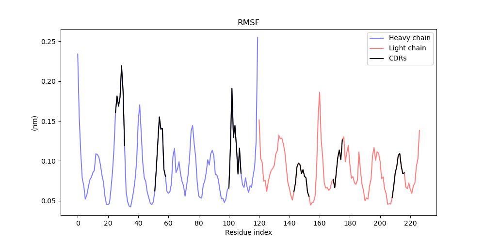
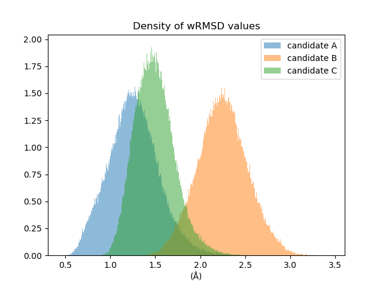
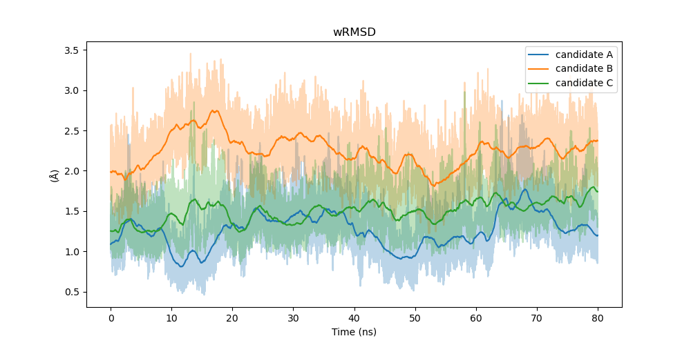

# Selection of antibodies humanized by scaffolding

Done by Nikita Vyatkin

**Supervisors:** Georgii Mamistvalov, Natalia Zenkova and Vladislav Strashko (BIOCAD)

## Goal and objectives of the project
**Goal:** To implement an in silico method for predicting humanized candidates with a high binding affinity based on their behavior in molecular dynamics simulations.

**Objectives:**
* Read articles on the topic, study the MD simulation method, master the tools: PyMOL, VMD, GROMACS
* Collect data: structures of mouse antibodies (anti-TNF-α, anti-EGFR, anti-GPC3, etc.) and sequences of humanized candidates
* Build 3D structures of humanized mAb candidates and run molecular dynamics simulations
* Analyze the obtained trajectories, calculate metrics (wRMSD) and compare them with the results from the article (Hsieh et al., 2022)

## Results
### RMSF
The root-mean-square-fluctuation (RMSF) is used to determine the movability weights.

### wRMSD
Smaller wRMSD values are indicative of a more similar behavior of the humanized candidate to the murine antibody.

